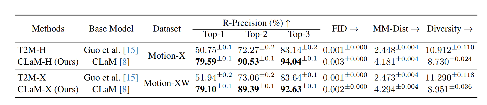

# CLaM-X: An Open-Source Library for Performance Evaluation of Text-driven Whole-body Human Motion Generation

## Introduction
CLaM-X is an extension of [CLaM (ACM MM 2024)](https://github.com/SheldongChen/CLaM) which is used to evaluate text-driven Whole-body human motion generation based on the SMPL-X model and Motion-X dataset [[v1 version in Dec. 2024]](https://github.com/IDEA-Research/Motion-X/tree/ce7c869273730152a469e564ee2df94e07117b34/tomato_represenation).


## Python Virtual Environment

Anaconda is recommended to create this virtual environment.

  ```sh
  # Create New Environment
  conda create -n clam python=3.8 -y
  # CUDA >=11.0, torch>=1.7.1
  pip install torch==1.7.1+cu110 torchvision==0.8.2+cu110 torchaudio==0.7.2 -f https://download.pytorch.org/whl/torch_stable.html
  
  # Install Others
  pip install ftfy regex tqdm scipy numpy==1.23.5 tensorrt spacy matplotlib==3.3.1

  # Install CLIP for CLaM
  cd CLIP_CLaM; python setup.py install --user; cd ..
  ```
  
  ## Download Data & Pre-trained Models
  ### Datasets
  We are using dataset: Motion-X. You could find the download link [[here]](https://drive.google.com/drive/folders/15p0-ljnEzDaTQYrLPHhozZ2ASTJhZ6x-?usp=sharing) or in the [motion-x github](https://github.com/IDEA-Research/Motion-X/tree/ce7c869273730152a469e564ee2df94e07117b34/tomato_represenation).   

  
  Download and unzip the dataset files -> Create a dataset folder -> Place related data files in dataset folder:
  ```sh
  mkdir ./dataset/
  ```
  Take motionx for an example, the file directory should look like this:  
  ```sh
  ./dataset/
  ./dataset/motionx/
  ./dataset/motionx/new_joint_vecs -> new_joint_vecs_face # Symbolic Link
  ./dataset/motionx/new_joint_vecs_face/ # body motion, hand gesture, facial expression
  ./dataset/motionx/texts -> texts_wo_aug # Symbolic Link
  ./dataset/motionx/texts_aug # Texts enhanced (only train set) using ChatGPT
  ./dataset/motionx/texts_wo_aug # Official Texts
  ./dataset/motionx/Mean.npy
  ./dataset/motionx/Std.npy
  ./dataset/motionx/test.txt
  ./dataset/motionx/train.txt
  ./dataset/motionx/val.txt
  ./dataset/motionx/nan_motion_path.txt # NAN value set as 0.0 in npy files of our download link
  ```

  The data format of npy under "./dataset/motionx/new_joint_vecs/"
  ```python
  data = np.load("./dataset/motionx/new_joint_vecs/xxx/xxx.npy")
  # root_rot_velocity (B, seq_len, 1)
  data[0:1]
  # root_linear_velocity (B, seq_len, 2)
  data[1:3]
  # root_y (B, seq_len, 1)
  data[3:4]
  # ric_data (B, seq_len, (joint_num - 1)*3)
  data[4: 4 + (joints_num - 1) * 3]
  # rot_data (B, seq_len, (joint_num - 1)*6)
  data[4 + (joints_num - 1) * 3: 4 + (joints_num - 1) * 9]
  # local_velocity (B, seq_len, joint_num*3)
  data[4 + (joints_num - 1) * 9: 4 + (joints_num - 1) * 9 + joints_num * 3]
  # face (B, seq_len, 50)
  data[4 + (joints_num - 1) * 9 + joints_num * 3 + 4: 4 + (joints_num - 1) * 9 + joints_num * 3 + 4 + 50]         
  # foot contact (B, seq_len, 4)
  data[4 + (joints_num - 1) * 9 + joints_num * 3 + 4 + 50:]
  ```

 ### Pre-trained Models for CLIP
  Create a checkpoint folder to place pre-trained models:
  ```sh
  mkdir ./pretrain_clip
  ```
 #### Download models from [[here]](https://drive.google.com/drive/folders/1g84pAku6bzRsVNpR-uKlY6k7wnDFnX7k?usp=sharing). Unzip and place them under checkpoint directory, which should be like
```
./pretrain_clip/ViT-B-32.pt
```

 ### Pre-trained Models for CLaM-X
  Create a checkpoint folder to place pre-trained models:
  ```sh
  mkdir ./checkpoints
  ```
    
 #### Download models for motionx from [[here]](https://drive.google.com/drive/folders/15kAFcLZoOOVWfbOF6frC9Dbd63R8ckUh?usp=sharing). Unzip and place them under checkpoint directory, which should be like
```
./checkpoints/motionx/
./checkpoints/motionx/Comp_v6_KLD01/           # Text-to-motion generation model
./checkpoints/motionx/Decomp_SP001_SM001_H512/ # Motion autoencoder
./checkpoints/motionx/length_est_bigru/        # Text-to-length sampling model
./checkpoints/motionx/text_mot_match -> text_mot_match_aug # Symbolic Link, Motion & Text feature extractors CLaM-X for evaluation
./checkpoints/motionx/text_mot_match_wo_aug/ # Train with Official Texts
./checkpoints/motionx/text_mot_match_aug/    # Train with Enhanced Texts
 ```

    
## Comparison on GT Motion Sequences

### Testing CLaM-X Models

#### motionx
```sh
python final_evaluations_motionx.py --gpu 0 --only_gt
```
This will evaluate the performance on gt of motionx dataset.
The following table shows the comparison with different evaluators on motionx test set using ground-truth motion sequences.




### Training CLaM-X Models
 All intermediate meta files/animations/models will be saved to checkpoint directory under the folder specified by argument "--name".

#### motionx
```sh
python -u train_tex_mot_match_motionx.py --name text_mot_match --gpu_id 0 --batch_size 64 --dataset_name motionx --lr 3e-5 --use_adamw --adamw_weight_decay 1e-1 --beta2 0.999 --eps 1e-8 --use_transformers --use_transformers_pretrain --tau 0.1 --alpha 0.02
```


## Comparison on Existing Text-to-Motion Algorithms


### Testing T2M-X based on [T2M](https://openaccess.thecvf.com/content/CVPR2022/papers/Guo_Generating_Diverse_and_Natural_3D_Human_Motions_From_Text_CVPR_2022_paper.pdf) (CVPR 2022)  Algorithm

#### motionx
```sh
python final_evaluations_motionx.py --gpu 0 
```
This will evaluate the performance of default motion generator named 'T2M' trained by Chuan Guo.


## License
CLaM-X is released under the [MIT License](https://github.com/SheldongChen/CLaM-X/blob/main/LICENSE).

## Acknowledgement
This repo is implemented based on [text-to-motion](https://github.com/EricGuo5513/text-to-motion) and [CLIP](https://github.com/openai/CLIP).

## **Citing CLaM-X**

If you use CLaM-X in your research, please use the following BibTeX entry.

```BibTeX
@inproceedings{chen2024clam,
title={CLaM: An Open-Source Library for Performance Evaluation of Text-driven Human Motion Generation},
author={Xiaodong Chen and Kunlang He and Wu Liu and Xinchen Liu and Zheng-Jun Zha and Tao Mei},
booktitle={ACM Multimedia (ACM MM)},
year={2024}
}
```